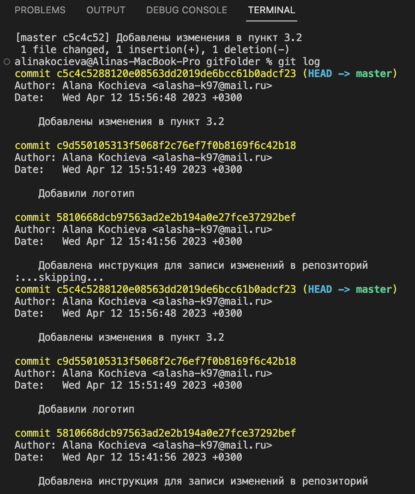
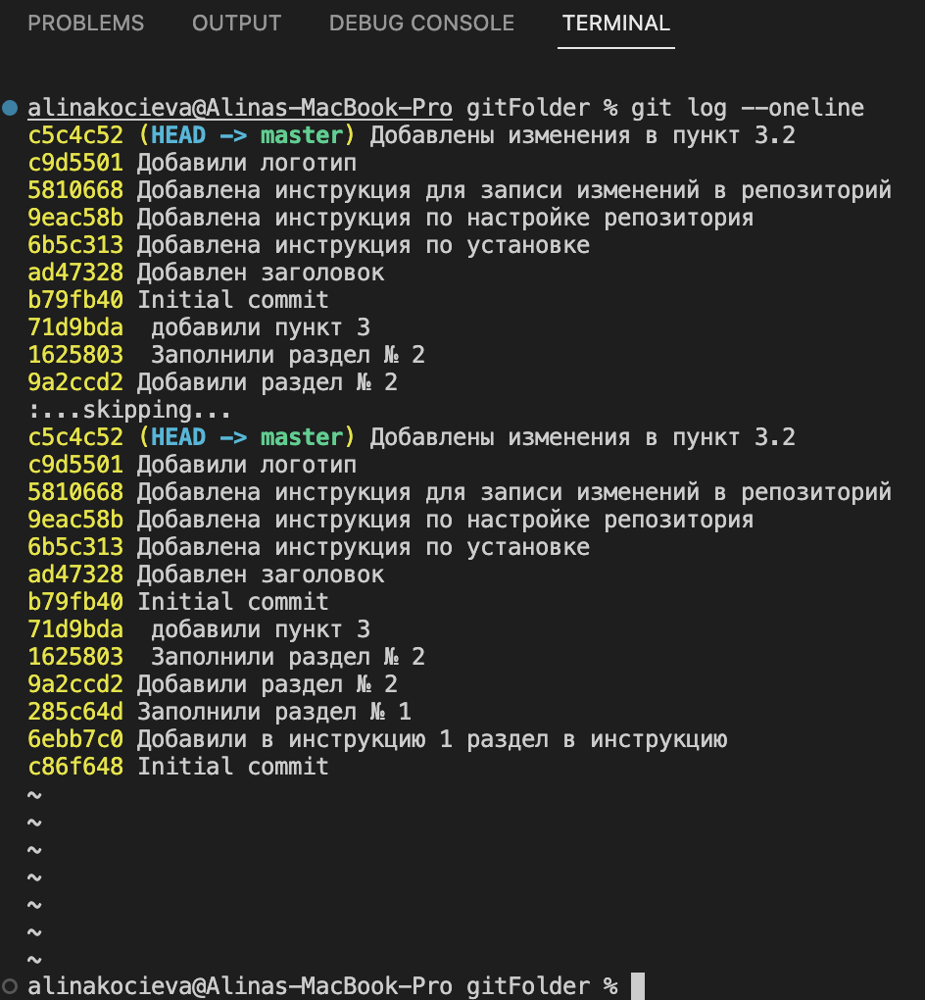
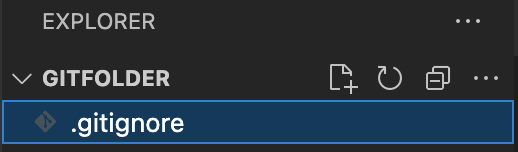
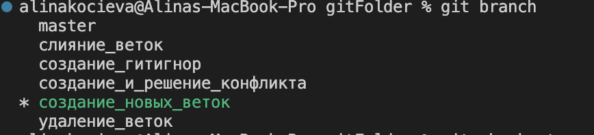
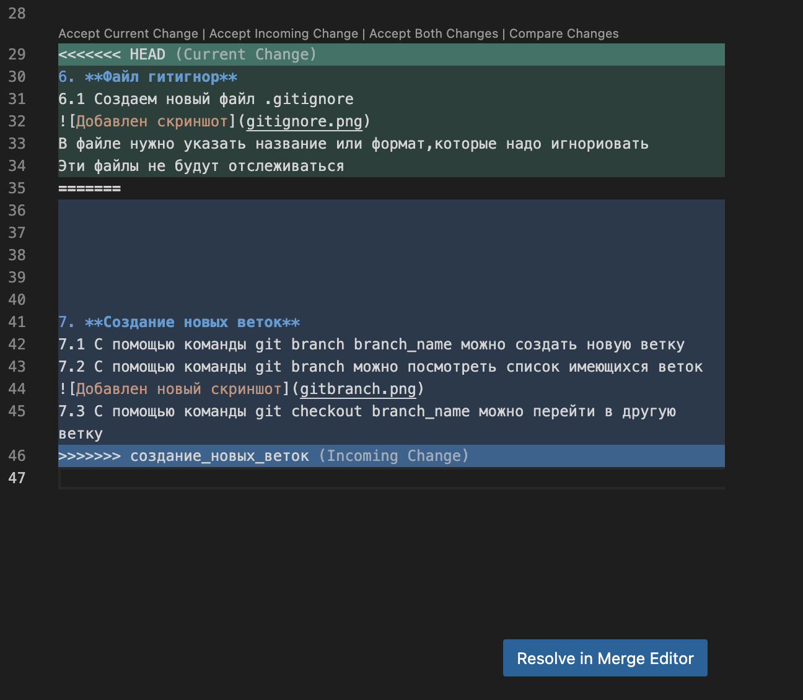
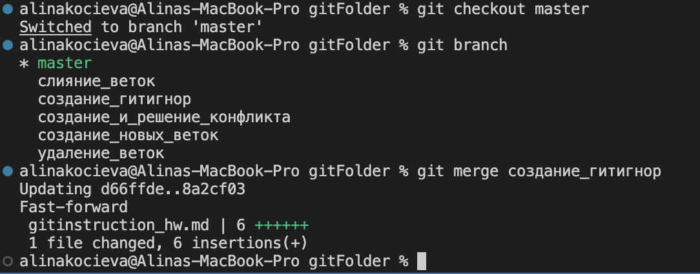
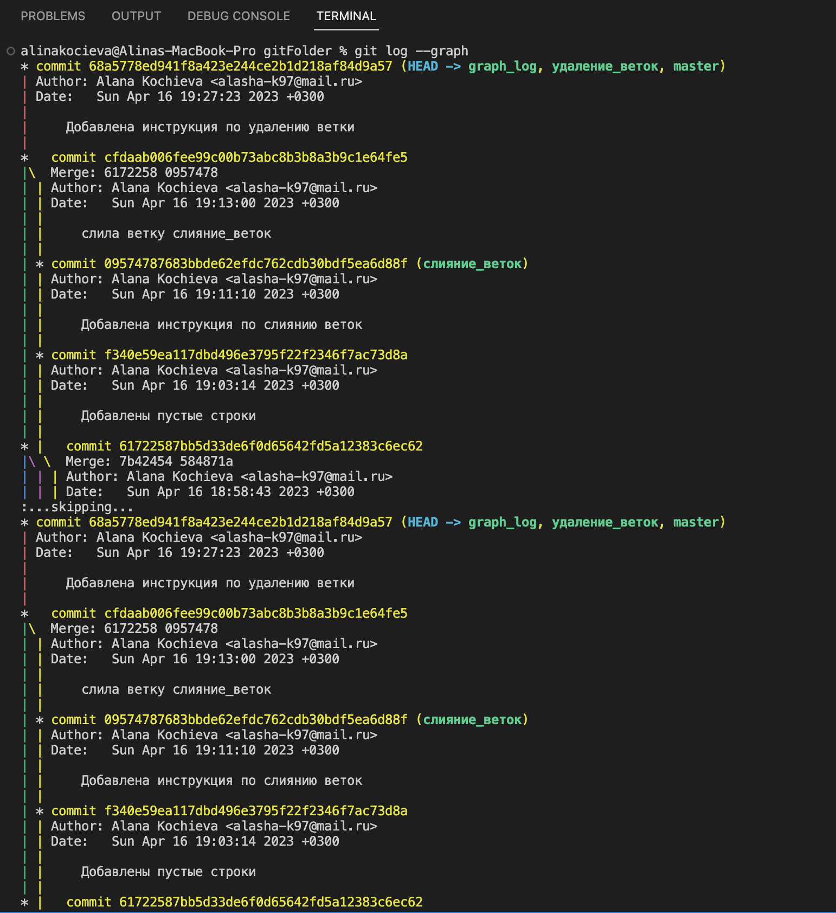
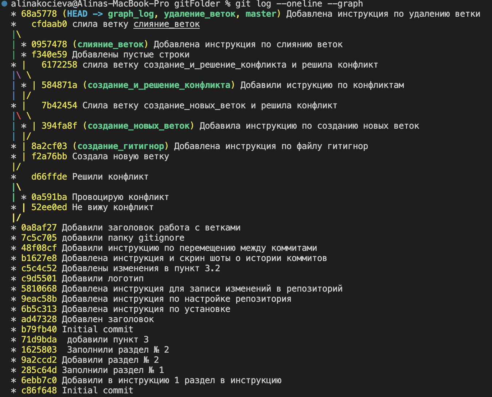

## Инструкция по работе с GIT 

1. **Уствновка**
    1.1 Загрузить и установить по ссылкам:
Git: https://git-scm.com
 Visual Studio Code: https://code.visualstudio.com
 
 2. **Инициализация и настройка репозитория**
 2.1 Создайте новую пустую папку
 2.2 В приложении Visual Studio Code откройте раннее созданную папку 
 2.3 Создайте файл с расширением .md в EXPLORER 
 2.4 Откройте терминал
 2.5 С помощью команды git init  создайте репозиторий 
 2.6 В папке которую создали в пункте 2.1 должна появиться папка .git 
 3. **Запись изменений в репозиторий**
 3.1 С помощью команды git status можно получить информацию от git о его текущим состоянии 
 3.2 С помощью команды git add "path" можно добавить файл или файлы к следующему коммиту (кнопкой tab выбрать нужный файл)
 3.3 С помощью команды git commit -m "message" создайте коммит (добавляем комментарий о добавленных изменениях)
4. **Получение информации о истории коммитов** 
4.1 С помощью команды git log можно проверить историю всех сохранений

4.2 С помощью команды git log --oneline можно посмотреть короткую версию истории сохранений

5. **Перемещение между коммитами**
5.1 C помощью команды git checkout переходим от дного коммита к другому
5.2 С помощью команды git checkout master можно вернуться к актуальному состоянию и продолжить работу
5.3 С помощью команды git diff можно увидеть разницу между текущими и закоммиченными файлами

6. **Файл гитигнор**
6.1 Создаем новый файл .gitignore 

В файле нужно указать название или формат,которые надо игнориовать 
Эти файлы не будут отслеживаться

7. **Создание новых веток**
7.1 С помощью команды git branch branch_name можно создать новую ветку 
7.2 С помощью команды git branch можно посмотреть список имеющихся веток 
 
7.3 С помощью команды git checkout branch_name можно перейти в другую ветку
8. **Создание и решение конфликтов**
8.1 Конфликты возникают, когда в разных ветках одна и та же строчка написана по-разному

8.2 Для того, чтобы решить конфликт необходимо выбрать нужный вариант решения из предложенных

*оставить текущий вариант
*принять новые изменения
*принять оба варианта
*сравнить изменения

9. **Слияние веток**
Для того, чтобы добавить одну ветку к другой нужно использовать команду git merge branch_name(слияние)

git merge lists - в текущую ветку добавит нформацию из ветки lists

10. **Удаление веток**
Для того, чтобы удалить ветку нужно использовать команду git branch -d branch_name 

11. **Визуализация коммитов**
Для того, чтобы увидеть лог коммитов с визуализацией между ними нужно использовать команду git log -- graph

С помощью команды git log --oneline --graph можно посмотреть короткую версию истории сохранений

12. **Настройка GitHub**
12.1 gitHub - сервис, который позволяет интегрироваться с программой гит и настроить удаленную работу с репозиторием.
git clone - позволяет склонировать внешний репозиторий на наш ПК.
git pull -  позволяет скачать все из текущего репозитория и автоматически сделать merge с нашей версией.
git push - позволяет отправить нашу версию репозитория на внешний репозиторий. Для этошо требуется авторизация на внешнем репозитории.
12.2 pull reguest -
команда для предложения изменений,
запрос на вливание изменений в репозиторий.
Для того, чтобы сделать pull reguest:
-делаем fork рупозитория 
-делаем clone своей версией репозитория 
-создаем новую ветку и в нее вносим свои изменения 
-фиксируем изменения 
-отправляем свою версию в свой gitHub 
-на сайте gitHub нажимаем кнопку pull reguest